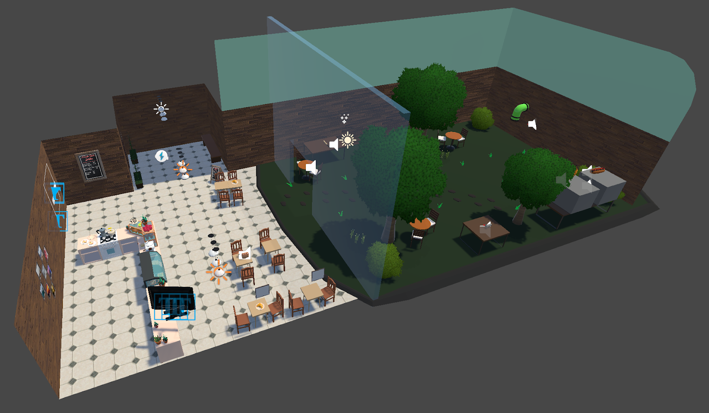

# ☕ Slime Valley

**Slime Valley** is an immersive VR sandbox experience set in a fantasy café. The project focuses on physics interactions and spatial audio to create a relaxing retreat from reality where users can play with adorable slimes.

## 📥 Download & Install

**[Download the .apk file (GitHub Releases)](https://github.com/HouIP/SlimeValley/releases/tag/release)** and follow the instructions to install on your VR device.

## 🎮 Key Features & Interactions

* **Dynamic Slime Interaction:** Pick up slimes using ray or direct interaction. You can feed them hotdogs (eating sounds) or bananas (toggle slimes gravity).
* **Two-Handed Transformation:** Physically grab a slime with both hands to stretch it larger or pinch it smaller. The slime's audio pitch changes dynamically based on its size.
* **Gadgets & Tools:**
  * **Slime Blaster:** Load multiple foods or slimes into a gun and launch them.
  * **Dispensers:** Spawn specific food or random slimes (with a rare chance for a King Slime).
  * **Slime Bat:** Hit a slime to split it into two smaller half-sized slimes.
  * **Locomotion:** Toggle between teleportation and continuous movement based on comfort preference.

## 📦 Assets Used

* **Models & Environment:** Kawaii Slimes, CoffeeShop Starter Pack, Menu Chalk Board, TV Arm Mount, Picture Frames, Dining Set, Simple Sky.
* **Materials & VFX:** Stylized Wood Textures, Sherbb's Particle Collection.
* **Music:** *On My Way* & *Morning Routine* (Ghostrifter Official), *When I Was A Boy* (Tokyo Music Walker).

## 🚀 Running the Project

### Development Setup (Unity Editor)

**Prerequisites:**
- Unity 2021.3.10f1 (or compatible LTS version)
- XR Interaction Toolkit package (should be included via Package Manager)
- VR headset connected (Tested on Quest 2/3) for testing

**Steps:**
1. **Open Project:** Launch Unity Hub and open the `SlimeValley` project folder.
2. **Open Scene:** Navigate to `Assets/Scenes/cafeScene.unity` and open it.
3. **XR Setup:** Ensure your VR headset is connected and recognized by Unity.
4. **Play Mode:** Press the Play button in the Unity Editor to enter Play Mode.
   - The scene will render in your connected VR headset if properly configured.
   - Use the Game view in the Editor for debugging (though VR interactions require the headset).

**Note:** For full VR testing, build and deploy to your Quest device (see Install section below).

## 🎓 Acknowledgment

This project was developed by **Group A** (Hou In Pun, Poom Hirunwiwatkul, Yu-Tong Wang, Zehan Cui) as coursework for **COMSM0127: Immersive Interaction and Audio Design** at the **University of Bristol**.
